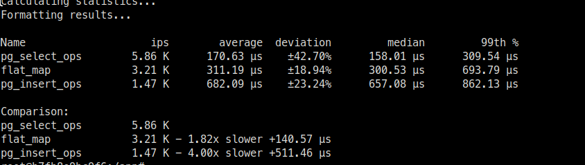

# Benchmarks

PG

```bash
# go to container
make console_gen_game
# run the benchmark
mix run lib/benchmark/db2_vs_pg/benchmark_start.exs
```

DB2

```bash
[TODO]
```

## Benchmark Detail

### Insert

pg_insert_ops:

```sql
INSERT INTO accounts (username, inserted_at, updated_at) VALUES (gen_random_uuid(), '2024-05-29 12:26:15', '2024-05-29 12:26:15')
```

db2_insert_ops:

```sql
# [TODO]
```

# Example results

PG



DB2

[TODO]

## Additional notes


benchmark pg default

PGPASSWORD=postgres pgbench -U postgres -h localhost -p 5433 -i -s 100 example
